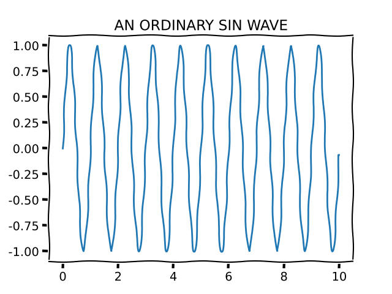

# Jupyter Matplotlibcpp

A header-only library for xeus-cling that lets you:

1. Build the data for plots in C++, and then
2. Use matplotlib to render them inline in a Jupyter notebook.

It's for people that love matplotlib and Jupyter, but want to program in C++.

# Huh?

You can put this program into a Jupyter notebook:

```cpp
#include <matplotlibcpp-jupyter.h>
#include <vector>

namespace plt = matplotlibcpp;

plt::jupyter::shown makePlot() {
    std::vector<double> t(1000);
    std::vector<double> x(t.size());
    
    for(size_t i=0; i < t.size(); i++) {
        t[i] = i / 100.0;
        x[i] = sin(2.0 * 3.14159265 * 1.0 * t[i]);
    }
    
    plt::xkcd();
    plt::plot(t,x);
    plt::title("AN ORDINARY SIN WAVE");
    return plt::jupyter::show();
}
```

and get this:



(see [notebooks/xkcd-example.ipynb](notebooks/xkcd-example.ipynb)).

# How?

This header-only library uses:

- [xeus-cling](https://github.com/jupyter-xeus/xeus-cling), a C++ kernel for Jupyter
- [matplotlibcpp](https://github.com/lava/matplotlib-cpp), C++ bindings for matplotlib

It adds [matplotlibcpp-jupyter.h](matplotlibcpp-jupyter.h), a header file that
defines the struct and supporting methods to get xeus-cling and Jupyter to render the
matplotlib results inline.

It doesn't write to any temp files or anything, it exports directly to an
in-memory png buffer using the python method `matplotlib.savefig()` and then
wraps that in a JSON object that Jupyter and xeus-cling understand.  This is done via
the C python API (most of the heavy lifting is via the Python interpreter).

# How do I use it?

The easiest way:

```
docker run --rm -it -v ${PWD}/notebooks:/notebooks -p 8889:8889 andrewjjenkins/matplotlibcpp-jupyter:latest
```

Build-it-yourself:

```
git submodule init
docker build . -t matplotlibcpp-jupyter
docker run --rm -it -v ${PWD}/notebooks:/notebooks -p 8889:8889 matplotlibcpp-jupyter:latest
```

If you want to use it in your own project:

1. Copy [matplotlibcpp-jupyter.h](matplotlibcpp-jupyter.h) and
[matplotlibcpp.h](https://github.com/lava/matplotlib-cpp/blob/master/matplotlibcpp.h)
into your project.

2. Install [xeus-cling](https://github.com/jupyter-xeus/xeus-cling) and
dependencies (see [environment.yml](environment.yml) if you use conda/mamba/similar).

# LICENSE

[MIT](LICENSE)
